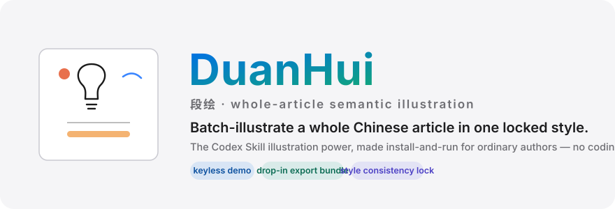
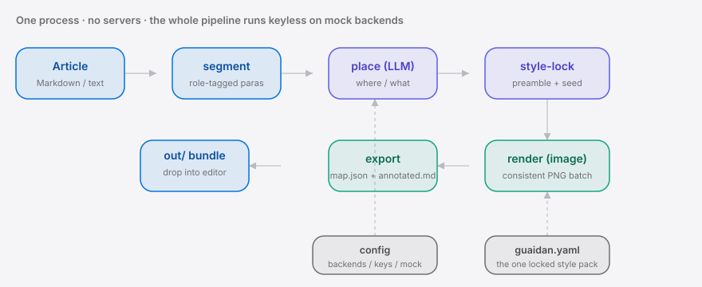

<div align="right"><sub><b>English</b>&nbsp;&nbsp;⇄&nbsp;&nbsp;<a href="./README.md">简体中文</a></sub></div>

<p align="center">
  <picture>
    <source media="(prefers-color-scheme: dark)" srcset="./assets/hero-dark.svg">
    <source media="(prefers-color-scheme: light)" srcset="./assets/hero-light.svg">
    
  </picture>
</p>

<p align="center"><sub>DuanHui is the install-and-run CLI that batch-illustrates a whole Chinese article in one locked native style — the Codex Skill illustration power, without a coding agent.</sub></p>

<p align="center">
  <a href="./LICENSE"></a>
  <a href="https://github.com/SuperMarioYL/duanhui/releases"></a>
  <a href="https://github.com/SuperMarioYL/duanhui/actions/workflows/ci.yml"></a>
  
  
  
</p>

**Paste a whole Chinese article; DuanHui reads the paragraph semantics to decide *where* to illustrate and *what each picture depicts*, then renders a batch of illustrations locked to one native white-canvas hand-drawn aesthetic — drop-in ready, with no code and no coding agent.**

The 6.3k-star hit [`helloianneo/ian-xiaohei-illustrations`](https://github.com/helloianneo/ian-xiaohei-illustrations) nailed this aesthetic — but it ships as a **Codex Skill**, so you need a coding agent to run it and ordinary 公众号 / 小红书 authors can't. Generic text-to-image, meanwhile, is single-image, English-prompt and style-drifty: it neither parses Chinese paragraph semantics to place illustrations nor locks a native look. DuanHui takes that **Skill** wave — the same one behind [`affaan-m/everything-claude-code`](https://github.com/affaan-m/everything-claude-code) — and strips the barrier: one command, zero environment, whole-article semantics, cross-image style consistency.

## Contents

- [Architecture](#architecture)
- [Why this exists](#why-this-exists)
- [Install](#install)
- [Quickstart](#quickstart)
- [Usage](#usage)
- [Demo](#demo)
- [Configuration](#configuration)
- [Roadmap](#roadmap)
- [Pricing (hosted)](#pricing-hosted)
- [License](#license)

<h2 id="architecture"> Architecture</h2>

One Python process, no servers. Two pluggable backend families (LLM placement + image generation), each with a keyless mock — so the whole pipeline (segment → place → style-lock → render → export) runs **with zero keys**.

<p align="center">
  <picture>
    <source media="(prefers-color-scheme: dark)" srcset="./assets/atlas-dark.svg">
    <source media="(prefers-color-scheme: light)" srcset="./assets/atlas-light.svg">
    
  </picture>
</p>

The core primitive is the **whole-article placement plan**: a typed structure mapping Chinese paragraph semantics onto "where + what to illustrate", plus a `consistency_seed` and a shared style preamble injected into every render prompt. That seed-plus-preamble is the concrete cross-image consistency mechanism — the workflow that neither a single-call Codex Skill nor generic text-to-image ever sequences.

<h2 id="why-this-exists"> Why this exists</h2>

Chinese knowledge / explainer authors routinely need 5–10 same-style hand-drawn illustrations per article, and get stuck two ways: the `ian-xiaohei`-style Skill is "for people who installed a coding agent — ordinary authors can't run it", while generic text-to-image is "single-image, hard to keep consistent". DuanHui collapses "whole article → a batch of consistent original illustrations" — half a day of per-image prompt wrangling — into one paste, and shows you a keyless preview of every decision (where each picture goes, what it depicts) *before* you spend a single credit.

<h2 id="install"> Install</h2>

Requires Python 3.12+.

```bash
git clone https://github.com/SuperMarioYL/duanhui.git
cd duanhui
pip install -e .          # or: uv pip install -e .
```

> A PyPI release is planned; after that, `pip install duanhui` / `uv tool install duanhui` will work directly.

<h2 id="quickstart"> Quickstart</h2>

Three commands from clone to a full illustration set — entirely keyless (mock backends, no credits spent):

```bash
duanhui run examples/sample_article.md --dry-run     # 1) preview the plan: where + what to illustrate
duanhui run examples/sample_article.md -o out/       # 2) full run → export bundle in out/
ls out/ && ls out/images/                             # 3) PNG batch + placement_map.json + annotated.md
```

<details><summary>what the placement preview looks like</summary>

```text
✓ segmented: 13 paragraphs (title: 为什么你的待办清单总是越列越长？)
            placement plan · 6 spots (mock preview, no credits spent)
 # │ para │ role    │ depicts                    │ why
 1 │  §1  │ concept │ 列下一长串今天要做的事     │ key concept — illustration helps visualise it
 2 │  §3  │ concept │ 帕金森定律指的是这样一个…  │ key concept — illustration helps visualise it
 4 │  §7  │ example │ 一份混着"回邮件…           │ concrete example/scene, good for a picture
 …
```

</details>

Swap in your own article. To wire up a real Chinese image backend for actual renders, run `duanhui init`.

<h2 id="usage"> Usage</h2>

```bash
# placement preview (keyless — no render, no export)
duanhui run my_article.md --dry-run

# full run: segment → place → style-lock → render → export; -n caps the count
duanhui run my_article.md -o out/ -n 6

# write config interactively (pick LLM / image backends, paste keys; blank stays mock)
duanhui init

# list backends / show version
duanhui backends
duanhui version
```

The export folder `out/` holds three things:

| File | Purpose |
|---|---|
| `images/illustration_NN.png` | a batch of same-style white-canvas hand-drawn illustrations, named in article order |
| `placement_map.json` | machine-readable map: each image → filename → segment idx → prompt / seed |
| `annotated.md` | the article with `▸ 图N` markers — paste each PNG into its paragraph by eye |

More examples in [`examples/`](./examples).

<h2 id="demo"> Demo</h2>

One command, from pasted article to a full illustration set (mock backend, keyless):


<h2 id="configuration"> Configuration</h2>

`duanhui init` writes `~/.duanhui/config.yaml`. Keys are read from environment variables first; any backend left without a key runs as mock.

| Key | Type | Default | Meaning |
|---|---|---|---|
| `llm_backend` | string | `deepseek` | placement backend: `mock` / `deepseek` / `qwen` / `glm` |
| `image_backend` | string | `tongyi-wanxiang` | render backend: `mock` / `tongyi-wanxiang` / `kling` / `jimeng` / `seedream` |
| `max_spots` | int | auto (≈6–8 by article length) | max illustrations per article |
| `keys.llm` / `keys.image` | string | none | optional inline keys (env vars preferred) |

Env vars: `DEEPSEEK_API_KEY` · `DASHSCOPE_API_KEY` (Tongyi / Qwen) · `ZHIPU_API_KEY` · `KLING_API_KEY` · `JIMENG_API_KEY` · `SEEDREAM_API_KEY`. Set `DUANHUI_MOCK=1` to force the keyless mock everywhere (CI uses this).

<h2 id="roadmap"> Roadmap</h2>

- [x] **m1 · segment + place** — paste article → role-tagged segments → keyless whole-article placement plan
- [x] **m2 · style-lock + render** — inject the hand-drawn style + shared seed per spot → consistent batch via a pluggable image backend
- [x] **m3 · export bundle** — images + `placement_map.json` + `annotated.md` assembled into one drop-in folder
- [ ] cover-pair mode (gated on real author interviews)
- [ ] multi-style pack switching (one locked aesthetic ships today)
- [ ] hosted "paste a URL, get images in the cloud, zero environment" tier (below)

<h2 id="pricing-hosted"> Pricing (hosted)</h2>

The local install and CLI are **free and open source, always**. A planned paid tier targets authors who don't want to configure a Chinese image API key or set up a local environment:

- **Zero-environment cloud rendering** — paste a URL / whole article, get images in the cloud, **pay-as-you-go** (≈¥0.3–0.5 per image, tracking the image backend's cost).
- **Membership** — ≈¥29 / month with a monthly image quota + batch export + multi-style pack subscription.

> The hosted tier is not built yet — it's signalled here as direction only. The v0.1 local tool is complete, free, and usable on its own.

<h2 id="license"> License</h2>

MIT. Bug reports and feature ideas welcome in [Issues](https://github.com/SuperMarioYL/duanhui/issues); PRs too.

---

## Share this

```
DuanHui — batch-illustrate a whole Chinese article in one locked native style. The Codex Skill illustration power, install-and-run, no coding agent. Paste an article, get a same-style set, export. Keyless dry-run. https://github.com/SuperMarioYL/duanhui
```

<p align="center"><sub><a href="./LICENSE">MIT</a> © 2026 SuperMarioYL</sub></p>
