[English](README.en.md) | **简体中文**

<picture>
  <source media="(max-width: 640px) and (prefers-color-scheme: dark)" srcset="assets/presentation/hero-mobile-dark.svg">
  <source media="(max-width: 640px)" srcset="assets/presentation/hero-mobile-light.svg">
  <source media="(prefers-color-scheme: dark)" srcset="assets/presentation/hero-dark.svg">
  
</picture>

**将中文文章分段，先预览配图位置与画面描述，再选择后端渲染并导出图片映射。**

`v0.6.0` · `Python 3.12+` · [Apache-2.0](LICENSE)

[Website](https://duanhui.lei6393.com) · [Demo record](docs/demo-results.json)

## 为什么使用

一篇文章要配多张图时，除了画面风格，还要考虑每张图应该接在哪一段。段绘把分段、位置计划和共享风格提示连接起来，让作者先检查计划，再进入可能收费的渲染步骤。

## 架构

<picture>
  <source media="(max-width: 640px) and (prefers-color-scheme: dark)" srcset="assets/presentation/architecture-mobile-dark.svg">
  <source media="(max-width: 640px)" srcset="assets/presentation/architecture-mobile-light.svg">
  <source media="(prefers-color-scheme: dark)" srcset="assets/presentation/architecture-dark.svg">
  
</picture>

segment.py 划分并标记段落，placement.py 校验后端返回的位置与描述，style.py 给每个 spot 加入共享前缀与 seed，image backend 渲染，export.py 输出图片、placement_map.json 和 annotated.md。cover.py 提供单张封面路径。

当前可用风格包括 [guaidan](styles/guaidan.yaml) 与 [shuimo](styles/shuimo.yaml)，由 --style 选择；旧 README 中“只支持一种风格、cover 尚未实现”已过时。

## 安装

需要 Python 3.12+。--dry-run 强制 mock；示例也显式设置 DUANHUI_MOCK=1，避免调用已配置的后端。

```bash
git clone https://github.com/SuperMarioYL/duanhui.git
cd duanhui
python3 -m venv .venv
source .venv/bin/activate
python -m pip install -e .
```

## 快速开始

实际运行文章配图和封面 dry-run。示例文章分为 13 段，最多 3 个配图点，另生成一条封面计划。没有生成真实插图，也没有验证模型审美或跨图一致性。

```bash
DUANHUI_MOCK=1 python -m duanhui.cli run examples/sample_article.md --dry-run -n 3
DUANHUI_MOCK=1 python -m duanhui.cli run examples/sample_article.md --cover --dry-run
```

完整文章在 [examples/sample_article.md](examples/sample_article.md)，命令在 [重放脚本](examples/presentation_demo.sh)。

## 使用

run FILE --dry-run 查看计划；-n 控制配图上限；--cover 切换封面路径；--style 选择风格。去掉 --dry-run 后进入渲染与导出；无 key 时使用 mock 占位图，有有效配置时可能调用付费 API。

## 实际 Demo

<picture>
  <source media="(max-width: 640px) and (prefers-color-scheme: dark)" srcset="assets/presentation/process-mobile-dark.svg">
  <source media="(max-width: 640px)" srcset="assets/presentation/process-mobile-light.svg">
  <source media="(prefers-color-scheme: dark)" srcset="assets/presentation/process-dark.svg">
  
</picture>

### 文章配图计划

13 段文章输出 3 个 mock 配图点。

```text
$ DUANHUI_MOCK=1 python -m duanhui.cli run examples/sample_article.md --dry-run -n 3
✓ 分段完成：13 段（标题：为什么你的待办清单总是越列越长？）
                          配图计划 · 共 3 处（mock 预览，未消耗任何额度）
┏━━━┳━━━━━━┳━━━━━━━━━┳━━━━━━━━━━━━━━━━━━━━━━━━━━━━━━━━━━━━━━┳━━━━━━━━━━━━━━━━━━━━━━━━━━━━━━━━━━━━━━┓
┃ # ┃ 段落 ┃ 角色    ┃ 配什么（depicts）                    ┃ 为什么                               ┃
┡━━━╇━━━━━━╇━━━━━━━━━╇━━━━━━━━━━━━━━━━━━━━━━━━━━━━━━━━━━━━━━╇━━━━━━━━━━━━━━━━━━━━━━━━━━━━━━━━━━━━━━┩
│ 1 │   §1 │ concept │ 列下一长串今天要做的事               │ 核心概念段落，配图帮助读者把抽象点 … │
│ 2 │   §3 │ concept │ 帕金森定律指的是这样一个现象：一项 … │ 核心概念段落，配图帮助读者把抽象点 … │
│ 3 │   §6 │ concept │ 清单本身也有成本                     │ 核心概念段落，配图帮助读者把抽象点 … │
└───┴──────┴─────────┴──────────────────────────────────────┴──────────────────────────────────────┘
╭──────────────────────────────────────────── dry-run ─────────────────────────────────────────────╮
│ 这是 --dry-run 预览，未渲染任何图片，也没有消耗额度。                                            │
│ 去掉 --dry-run 即可渲染并导出整套配图；运行 duanhui init 接入真实的国产图像后端。                │
╰──────────────────────────────────────────────────────────────────────────────────────────────────╯
```

### 封面计划

从标题得到单张封面描述，尚未渲染。

```text
$ DUANHUI_MOCK=1 python -m duanhui.cli run examples/sample_article.md --cover --dry-run
✓ 分段完成：13 段（标题：为什么你的待办清单总是越列越长？）
✓ 封面计划：为什么你的待办清单总是越列越长 （mock 预览未消耗额度）
╭─────────────────────────────────────── dry-run · 封面模式 ───────────────────────────────────────╮
│ 这是 --dry-run 预览，未渲染任何图片，也没有消耗额度。                                            │
│ 去掉 --dry-run 即可渲染封面图（cover.png）；运行 duanhui init 接入真实的国产图像后端。           │
╰──────────────────────────────────────────────────────────────────────────────────────────────────╯
```

## 能力与接入

<picture>
  <source media="(max-width: 640px) and (prefers-color-scheme: dark)" srcset="assets/presentation/integrations-mobile-dark.svg">
  <source media="(max-width: 640px)" srcset="assets/presentation/integrations-mobile-light.svg">
  <source media="(prefers-color-scheme: dark)" srcset="assets/presentation/integrations-dark.svg">
  
</picture>

placement_map 记录每张图的段落索引、prompt 和 seed，annotated.md 给作者定位提示。共享 seed 与前缀是一种控制输入的方式，不能单独保证不同模型输出同一视觉风格。


## 配置

配置来自 CLI 覆盖、环境变量、YAML 和默认值。init 写入 ~/.duanhui/config.yaml；DUANHUI_HOME 可改目录，DUANHUI_MOCK=1 强制 mock。LLM 后端为 deepseek/qwen/glm，图像后端有通义万相、可灵、即梦、Seedream；密钥通过对应环境变量或配置读取。

## 路线图与范围

v0.6.0 已包含文章计划、封面模式、两个风格包、渲染 adapter 和导出包。更丰富风格与托管服务仍是后续方向，没有已上线的云端订阅或保证价格。

- mock 计划和占位图不代表真实模型的语义或图像质量。
- 共享风格提示不保证每张生成图完全一致。
- 本次未验证远程 API、图片渲染和平台发布。

[Terminal recording](assets/demo.gif) · [Recording script](docs/demo.tape)

## 许可证

[Apache-2.0](LICENSE)
