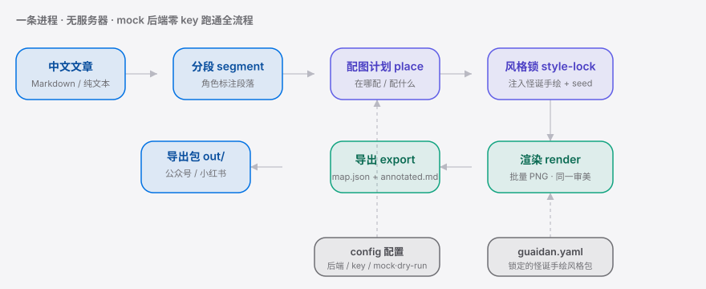

<div align="right"><sub><a href="./README.en.md">English</a>&nbsp;&nbsp;⇄&nbsp;&nbsp;<b>简体中文</b></sub></div>

<p align="center">
  <picture>
    <source media="(prefers-color-scheme: dark)" srcset="./assets/hero-cn-dark.svg">
    <source media="(prefers-color-scheme: light)" srcset="./assets/hero-cn-light.svg">
    
  </picture>
</p>

<p align="center"><sub>段绘是把爆款 Codex Skill 配图做成普通作者装即用、整篇语义批量同风格出图的命令行工具。</sub></p>

<p align="center">
  <a href="./LICENSE"></a>
  <a href="https://github.com/SuperMarioYL/duanhui/releases"></a>
  <a href="https://github.com/SuperMarioYL/duanhui/actions/workflows/ci.yml"></a>
  
  
  
</p>

**贴进一整篇中文文章，段绘按段落语义自动决定「在哪配图、配什么」，再产出一批锁定同一种白底怪诞手绘审美的插图——导出即用，全程不写一行代码、不必装 coding-agent。**

那个 6.3k★ 的爆款 [`helloianneo/ian-xiaohei-illustrations`](https://github.com/helloianneo/ian-xiaohei-illustrations) 把这套审美做成了 **Codex Skill**——必须装了 coding-agent 才能跑，普通公众号 / 小红书作者根本起不动；通用文生图又是单张出图、英文 prompt、风格漂移，既不解析中文段落语义决定配图位置，也锁不住这一本土审美。段绘正是把这个 **Skill** 的能力拆掉门槛：一条命令、零环境、整篇语义、跨图同风格。

## 目录

- [架构](#架构)
- [为什么需要它](#为什么需要它)
- [安装](#安装)
- [快速开始](#快速开始)
- [用法](#用法)
- [Demo](#demo)
- [配置](#配置)
- [路线图](#路线图)
- [付费层（hosted）](#付费层hosted)
- [License](#license)

<h2 id="架构"> 架构</h2>

一条 Python 进程、无服务器。两类可插拔后端（LLM 放置 + 图像出图），各自带一个无需 key 的 mock 实现，所以整条流水线——分段 → 配图计划 → 风格锁 → 渲染 → 导出——都能 **零 key 跑通**。

<p align="center">
  <picture>
    <source media="(prefers-color-scheme: dark)" srcset="./assets/atlas-cn-dark.svg">
    <source media="(prefers-color-scheme: light)" srcset="./assets/atlas-cn-light.svg">
    
  </picture>
</p>

核心原语是**整篇配图计划（whole-article placement plan）**：一份把中文段落语义映射到「在哪配、配什么」的类型化结构，外加一个 `consistency_seed` + 共享风格前缀注入到每一张图的 prompt——这就是跨图同风格的具体机制，也是 Codex Skill（单次调用）和通用文生图（无语义放置、无审美锁）都没沉淀的工作流。

<h2 id="为什么需要它"> 为什么需要它</h2>

做知识 / 科普类图文的中文作者，常常一篇文章要配 5–10 张同风格手绘插图，却卡在两条死路上：想用 `ian-xiaohei` 那类 Skill，但「是给装了 coding-agent 的人用的，普通作者跑不起来」；退而用通用文生图，又「单张出图、风格难统一」。段绘把「整篇文章 → 一批同风格原创插图」这件半天的活，压缩成一次粘贴——而且先给你一份 keyless 的配图计划预览，让你在花任何额度之前就看清每张图配在哪、画什么。

<h2 id="安装"> 安装</h2>

需要 Python 3.12+。

```bash
git clone https://github.com/SuperMarioYL/duanhui.git
cd duanhui
pip install -e .          # 或： uv pip install -e .
```

> 之后会发布到 PyPI，届时可直接 `pip install duanhui` / `uv tool install duanhui`。

<h2 id="快速开始"> 快速开始</h2>

三条命令，从零到导出一套配图——全程 keyless（用 mock 后端，不消耗任何额度）：

```bash
duanhui run examples/sample_article.md --dry-run     # 1) 先看配图计划：在哪配、配什么
duanhui run examples/sample_article.md -o out/       # 2) 跑完整流程，导出到 out/
ls out/ && ls out/images/                             # 3) 拿到 PNG 批 + placement_map.json + annotated.md
```

<details><summary>配图计划预览长这样</summary>

```text
✓ 分段完成：13 段（标题：为什么你的待办清单总是越列越长？）
            配图计划 · 共 6 处（mock 预览，未消耗任何额度）
 # │ 段落 │ 角色    │ 配什么（depicts）          │ 为什么
 1 │  §1  │ concept │ 列下一长串今天要做的事     │ 核心概念段落，配图帮助读者把抽象点视觉化
 2 │  §3  │ concept │ 帕金森定律指的是这样一个…  │ 核心概念段落，配图帮助读者把抽象点视觉化
 4 │  §7  │ example │ 一份混着"回邮件…           │ 具体例子/场景，适合用画面呈现
 …
```

</details>

把 `examples/sample_article.md` 换成你自己的文章即可。想接入真实的国产图像后端出真图，运行 `duanhui init`。

<h2 id="用法"> 用法</h2>

```bash
# 配图计划预览（keyless，不渲染、不导出）
duanhui run my_article.md --dry-run

# 完整跑：分段 → 配图计划 → 风格锁 → 渲染 → 导出；-n 限制最多配几张
duanhui run my_article.md -o out/ -n 6

# 交互式写配置（选 LLM / 图像后端、粘贴 key；不填则继续走 mock）
duanhui init

# 看可选后端 / 版本
duanhui backends
duanhui version
```

导出目录 `out/` 里有三样东西：

| 文件 | 作用 |
|---|---|
| `images/illustration_NN.png` | 一批同风格白底怪诞手绘插图，按文章顺序命名 |
| `placement_map.json` | 机器可读映射：每张图 → 文件名 → 段落 idx → prompt / seed |
| `annotated.md` | 带「▸ 图N」标记的文章，照着把每张 PNG 贴进对应段落即可 |

更多示例见 [`examples/`](./examples)。

<h2 id="demo"> Demo</h2>

一条命令，从粘贴文章到拿到一整套配图（mock 后端，keyless）：


<h2 id="配置"> 配置</h2>

`duanhui init` 写入 `~/.duanhui/config.yaml`。key 优先从环境变量读取，留空的后端自动以 mock 运行。

| 键 | 类型 | 默认 | 含义 |
|---|---|---|---|
| `llm_backend` | string | `deepseek` | 放置（决定在哪配图）后端：`mock` / `deepseek` / `qwen` / `glm` |
| `image_backend` | string | `tongyi-wanxiang` | 出图后端：`mock` / `tongyi-wanxiang` / `kling` / `jimeng` / `seedream` |
| `max_spots` | int | 自动（按文章长度估算 6–8 张） | 单篇最多配几张图 |
| `keys.llm` / `keys.image` | string | 无 | 可选内联 key（更推荐用环境变量） |

环境变量：`DEEPSEEK_API_KEY` · `DASHSCOPE_API_KEY`（通义 / Qwen）· `ZHIPU_API_KEY` · `KLING_API_KEY` · `JIMENG_API_KEY` · `SEEDREAM_API_KEY`。设 `DUANHUI_MOCK=1` 可强制全程 mock（CI 即用此项）。

<h2 id="路线图"> 路线图</h2>

- [x] **m1 · 分段 + 配图计划** — 贴文章 → 角色标注分段 → keyless 打印整篇配图计划
- [x] **m2 · 风格锁 + 渲染** — 每个配图点注入怪诞手绘风格 + 共享 seed → 可插拔图像后端渲染同风格批量
- [x] **m3 · 导出包** — 图片 + `placement_map.json` + `annotated.md` 组装成一键贴用的导出文件夹
- [ ] 封面对（cover-pair）模式（按真实作者访谈反馈再决定是否做）
- [ ] 多审美风格包切换（当前锁定一种怪诞手绘）
- [ ] hosted「贴 URL 直接云端出图、零环境」tier（见下）

<h2 id="付费层hosted"> 付费层（hosted）</h2>

本地安装与命令行**永远免费开源**。规划中的付费层面向「不想配 国产图像 API key / 不想本地装环境」的作者：

- **零环境云端出图**：贴 URL / 整篇文章，云端直接出图，**按量计费**（约 ¥0.3–0.5 / 张，随图像后端成本浮动）。
- **会员订阅**：约 ¥29 / 月，含每月若干张额度 + 批量导出 + 多审美风格包订阅。

> 付费层尚未构建，仅在此露出方向；v0.1 的本地工具完整、免费、可独立使用。

<h2 id="license"> License</h2>

Apache-2.0。欢迎在 [Issues](https://github.com/SuperMarioYL/duanhui/issues) 提 bug / 需求，或发 PR。

---

## Share this

```
段绘（DuanHui）— 把爆款 Codex Skill 的中文正文配图做成普通作者装即用的命令行工具：贴整篇文章，按段落语义批量出一组同风格白底怪诞手绘插图，导出即用。零环境、keyless 试跑。 https://github.com/SuperMarioYL/duanhui
```

<p align="center"><sub><a href="./LICENSE">Apache-2.0</a> © 2026 SuperMarioYL</sub></p>
